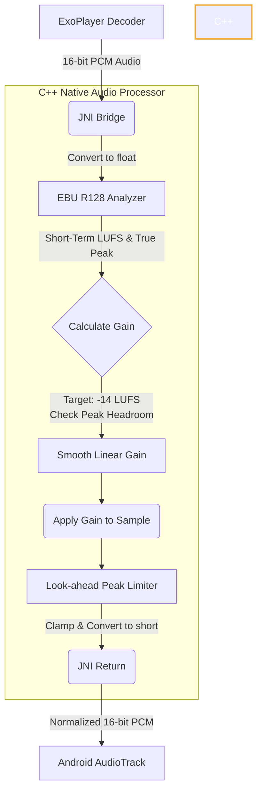

<p align="center">
  
</p>

<h1 align="center">KittyTune (=^･ω･^=)</h1>

<p align="center">
  <a href="https://github.com/alan7383/kittytune/blob/main/LICENSE">
    
  </a>
  <a href="https://github.com/alan7383/kittytune/releases">
    
  </a>
  <a href="https://github.com/alan7383/kittytune/stargazers">
    
  </a>
  <a href="https://ko-fi.com/alan7383">
    
  </a>
  
  
  <a href="https://github.com/alan7383/KittyTuneDesktop">
    
  </a>
</p>

<p align="center">
  <strong>A SoundCloud-first Android player with guest mode, YouTube fallback, local files, offline downloads, lyrics, widgets, and a lot of real extras.</strong>
</p>

> [!NOTE]
> KittyTune is still in active development and far from finished, so please treat it as a beta. Some features might be broken or incomplete. If you run into any bugs or weird behavior, feel free to [open an issue](https://github.com/alan7383/kittytune/issues) to help track them down! Keep in mind I'm working on this alone during my free time, so I won't always be able to fix things right away.

> [!TIP]
> 💻 **Looking for KittyTune on Desktop?** KittyTune is also available for **Windows**, **Linux** (*Arch Linux*, *Debian / Ubuntu `.deb`*, *Fedora / openSUSE `.rpm`*, and *universal `.AppImage`*), and **macOS**! Check out [KittyTuneDesktop](https://github.com/alan7383/KittyTuneDesktop).

---

### ~ what is this

KittyTune is an open-source Android music player built around **SoundCloud**, with optional login, a real **guest mode**, and a **YouTube search / stream fallback** for tracks that are restricted, missing, or annoying to access normally.

It also pulls in the things a lot of music apps either skip or hide behind rough UX: **offline downloads**, **local folder scanning**, **lyrics**, **audio recognition**, **audio effects**, **Discord Rich Presence**, **widgets**, **listening stats**, **achievements**, and **Android Auto** support.

<p align="center">
  
  
  
</p>

---

### * features

<details open>
<summary><b>$ music import & transfer</b></summary>

* **Import your music & playlists** from 7 major platforms (**Spotify, Apple Music, YouTube Music, Deezer, Tidal, Amazon Music, BoomPlay**) straight into your SoundCloud account.
* **Powered by the native SoundCloud mobile GraphQL API**, analyzed and integrated directly for account sync and progress tracking.

<p align="center">
  
</p>
</details>

<details>
<summary><b>~ discovery & sources</b></summary>

* **SoundCloud-first discovery** with home feed, stream, charts, moods, genres, tags, albums, and radio/station flows.
* **Search tracks, artists, playlists, and albums** from SoundCloud.
* **Track recognition** built right in via ShazamKit to identify songs playing around you and find them instantly.
* **Switch search source to YouTube** when you want direct video/audio results instead.
* **Paste SoundCloud or YouTube links** directly into search and jump to the right track, playlist, profile, or station.
* **Guest mode** works without connecting a SoundCloud account.

<p align="center">
  
  &nbsp;&nbsp;
  
  &nbsp;&nbsp;
  
</p>
</details>

<details>
<summary><b>> library & offline</b></summary>

* Keep **liked tracks, liked playlists, saved artists, local playlists, and downloads** in one library.
* **Download single tracks or full playlists** for offline playback.
* **Choose a custom download location** and keep tagged files with embedded artwork when possible.
* **Import local music folders** and scan subfolders recursively.
* Supports local audio formats including **MP3, FLAC, WAV, M4A, AAC, OGG, WMA, OPUS, AMR, and MP4 audio**.
* **Backup and restore** playlists, favorites, history, stats, achievements, and app settings.
</details>

<details>
<summary><b>+ player & lyrics</b></summary>

* **Background playback** with notification controls, media buttons, and persistent queue restore.
* **Autoplay radio**, **shuffle / repeat**, **stream quality selection**, and **precise speed control**.
* **Sleep timer** with custom duration, end-of-track mode, and optional progressive fade-out.
* **Synced or plain lyrics** with fullscreen view, inline player mode, manual search, and copy support.
* **Live lyrics translation** to quickly understand songs in your native language.
* **Local lyrics support** for files that already contain embedded lyrics.
* **YouTube fallback for restricted SoundCloud tracks** when enabled in settings.

<p align="center">
  
  &nbsp;&nbsp;
  
  &nbsp;&nbsp;
  
</p>
</details>

<details>
<summary><b># audio & widgets</b></summary>

* Built-in audio effects: **bass boost**, **8D audio**, **muffled filter**, **reverb**, **rain overlay**, and **pitch/speed control**.
* **True loudness normalization (EBU R128)** processed natively in C++ for perfectly matched volume across all your tracks.
* Effects are processed directly in the playback pipeline with Media3 / ExoPlayer.
* **Configurable home widget** with playback controls, like toggle, speed shortcuts, and effect toggles.
* **Mini player widget** for quick controls.
* **Search widget** to jump straight into app search.

<p align="center">
  
</p>
</details>

<details>
<summary><b>% account, social & extras</b></summary>

* When signed in, KittyTune can handle **likes sync, reposts, comments, notifications, conversations, and profile access**.
* **Edit your SoundCloud profile**, including avatar and banner, from inside the app.
* **Discord Rich Presence** integration with configurable status display.
* **Listening stats** for top tracks, top artists, play history, and total listening time.
* **47 achievements** with XP, streak tracking, and optional popup notifications.
* **Android Auto** media support.

<p align="center">
  
</p>
</details>

<details>
<summary><b>@ ui & customization</b></summary>

* **Jetpack Compose + Material 3** interface utilizing the latest **Material 3 Expressive** shapes.
* **Dynamic color / Material You**, light mode, dark mode, and pure black mode.
* **Custom color palette controls** and multiple player background styles.
* **Variable font controls** for weight, width, slant, roundness, and more.
* Translated resources for **many locales**, with explicit in-app language switching for **French, English, German, Hungarian, Russian, and Vietnamese**.
* Built-in **GitHub release update checker**.
* Redesigned about screen with **Ko-fi support card** to easily tip if you like the app.

<p align="center">
  
  &nbsp;&nbsp;
  
  &nbsp;&nbsp;
  
</p>
</details>

<details>
<summary><b>$ deep dive: volume normalization</b></summary>

I wanted to make sure you don't get your ears blasted when an aggressively mastered rap track plays right after a quiet acoustic one. So I fully implemented **EBU R128 loudness normalization** right into the audio pipeline.

Instead of just checking the "peak" volume of a song (which honestly doesn't mean much for how loud a song *feels* to human ears), the EBU R128 standard measures the **perceived loudness** in LUFS (Loudness Units relative to Full Scale). KittyTune measures this and targets a standard loudness level, smoothly applying gain so every song feels consistently loud.

**why c++?**

Audio DSP (Digital Signal Processing) requires manipulating tens of thousands of audio samples per second in real-time. If we did this in Kotlin/Java, it would create way too much garbage collection (GC) overhead and CPU usage, which drains your battery faster and can cause audio stuttering. 

By writing this core processor in C++ using the Android NDK, we get direct memory access and blazing fast performance. We grab the raw PCM audio buffers from ExoPlayer via JNI, normalize them instantly, and hand them back with virtually zero overhead.


</details>

---

### > install

<p align="center">
  <a href="https://github.com/alan7383/kittytune/releases">
    
  </a>
</p>

Download the latest APK from the [releases page](https://github.com/alan7383/kittytune/releases).

KittyTune targets **Android 8.0+ (API 26+)**.

---

### + build

```bash
git clone https://github.com/alan7383/kittytune.git
cd kittytune
./gradlew assembleDebug
```

---

### * under the hood

* **Kotlin** & **C++ (NDK)**
* **Jetpack Compose**
* **Media3 / ExoPlayer**
* **Room**
* **NewPipe Extractor**
* **InnerTune / Innertube**
* **LrcLib**
* **Kizzy**
* **ShazamKit**

---

### ☕ support

If you enjoy using **KittyTune** and want to support its ongoing development, consider buying me a coffee!

<p align="center">
  <a href="https://ko-fi.com/alan7383" target="_blank">
    
  </a>
</p>

---

### ^ contributors

thanks to everyone who helps make KittyTune better:

<a href="https://github.com/wynriu" title="wynriu">
  
</a>
<a href="https://github.com/sneoww98" title="sneoww98">
  
</a>
<a href="https://github.com/quntqunt" title="quntqunt">
  
</a>
<a href="https://github.com/tankist939-afk" title="tankist939-afk">
  
</a>

---

### ~ credits & license

Big thanks to the projects that help power KittyTune:

* [NewPipe Extractor](https://github.com/TeamNewPipe/NewPipeExtractor)
* [InnerTune](https://github.com/z-huang/InnerTune)
* [LrcLib](https://lrclib.net/)
* [Kizzy RPC](https://github.com/dead8309/Kizzy)

KittyTune is licensed under **GNU GPL v3.0**. See the [LICENSE](LICENSE) file for details.

---

<p align="center">
  made with (=｀ω´=) and too many ideas by <a href="https://github.com/alan7383">alan7383</a>
</p>
